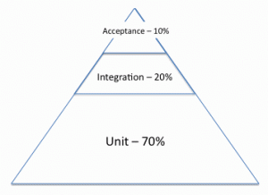
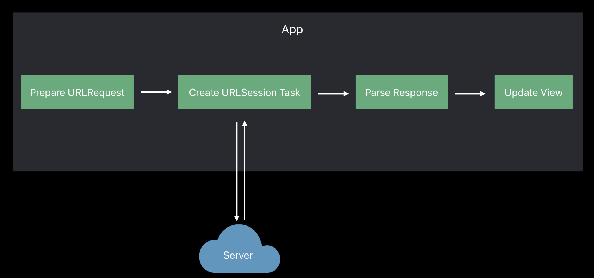
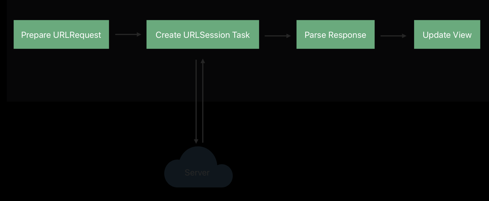
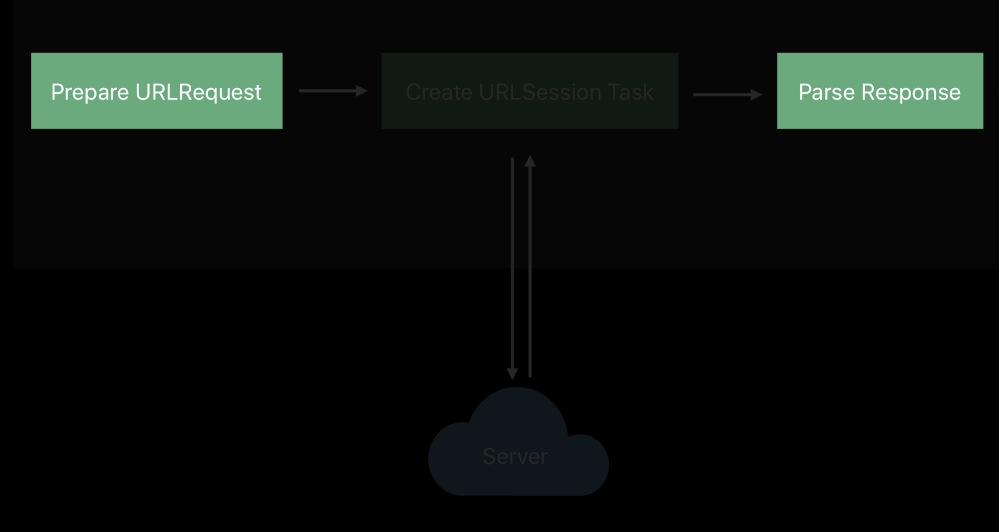
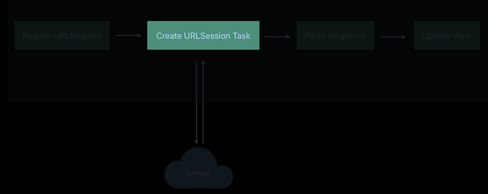
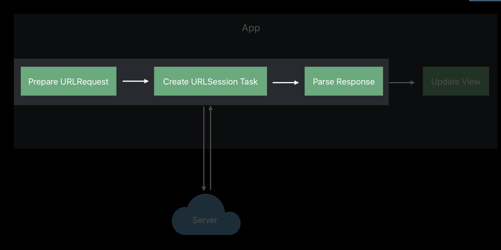
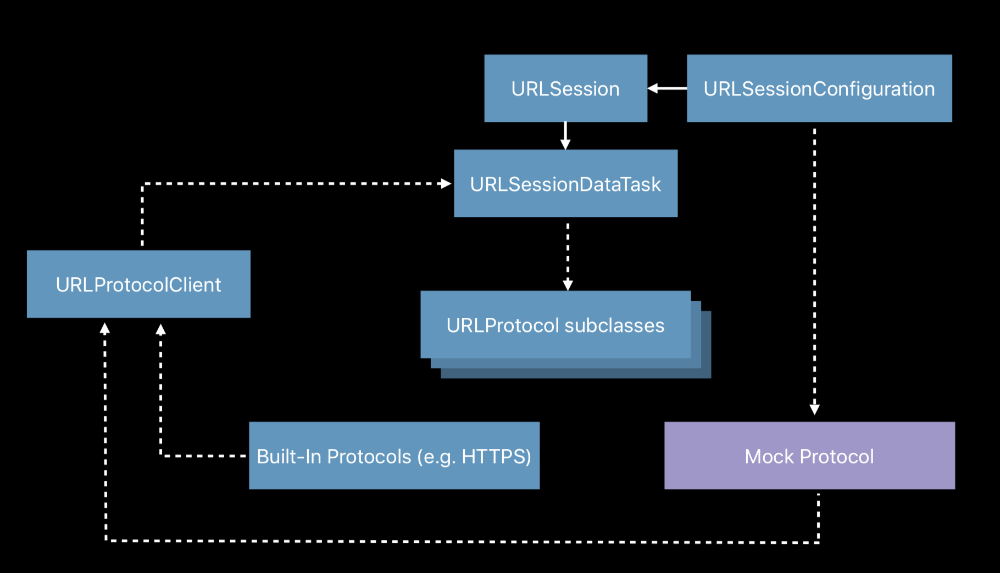
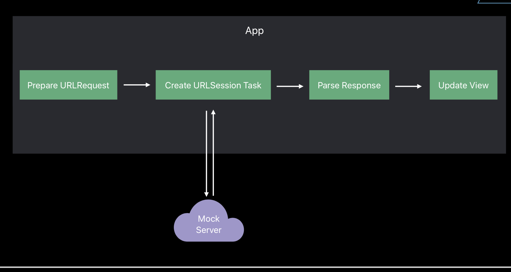
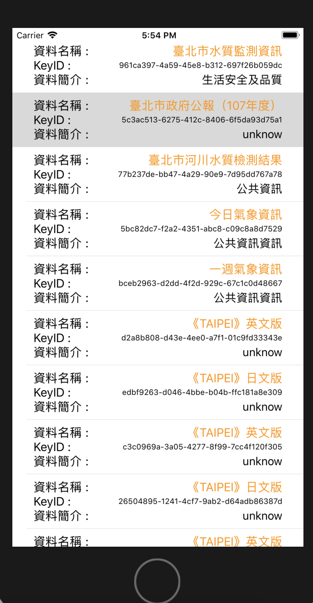

# IOS單元側試技巧與提示

[](https://travis-ci.org/m10117013/swiftUnitTestingTipsAndTricks)

[](https://coveralls.io/github/m10117013/swiftUnitTestingTipsAndTricks?branch=master)


* 測試金字塔


	
* Unit 70%
* Integration 20%
* Acceptance 10%


## Network mocking requests



這是一個標準的發送Request處理順序
> a. 準備URLRequest
> 
> b. 產生URLSession
> 
> c. 解析資料
> 
> d. 更新UI


**假定我們有一個基本的request如下,傳入附近座標,並且在回傳做一些處理.**

```
func loadData(near coord: CLLocationCoordinate2D) {
	//a. 準備URLRequest
	let url = URL(string: "/locations?lat=\(coord.latitude)&long=\(coord.longitude)")!
	//b. 產生URLSession
	URLSession.shared.dataTask(with: url) { data, response, error in
		guard let data = data else { self.handleError(error); return }
		do {
			//c. 解析資料
			let values = try JSONDecoder().decode([PointOfInterest].self, from: data)
			//d. 更新UI
			DispatchQueue.main.async {
				self.tableValues = values
				self.tableView.reloadData()
		}
		} catch {
		}
		self.handleError(error)
	}.resume()
}
```


**此時如果server沒有ready,或是我們想要在不相依server情況下測試該怎麼做?**



> 先將 URLSesstion Task 不相依 remote server

剛剛上面的寫法應問都把所有code集中在同一個function,這會使測試難度升高,因此這裡需要做一些改變.

***建立一個專門處理產生request與解析封包的結構(SRP)***

```
struct PointsOfInterestRequest {

	//a.產生request
	func makeRequest(from coordinate: CLLocationCoordinate2D) throws -> URLRequest {
		//處理例外
		guard CLLocationCoordinate2DIsValid(coordinate) else {
			throw RequestError.invalidCoordinate
		}
		//產生components
		var components = URLComponents(string: "https://example.com/locations")!
			components.queryItems = [
			URLQueryItem(name: "lat", value: "\(coordinate.latitude)"),
			URLQueryItem(name: "long", value: "\(coordinate.longitude)")
		]
		return URLRequest(url: components.url!)
	}
	
	//b.解析封包
	func parseResponse(data: Data) throws -> [PointOfInterest] {
		return try JSONDecoder().decode([PointOfInterest].self, from: data)
	}
}
```


***現在可以針對PointsOfInterestRequest做unit test***

```
 class PointOfInterestRequestTests: XCTestCase {
	let request = PointsOfInterestRequest()
	func testMakingURLRequest() throws {
		let coordinate = CLLocationCoordinate2D(latitude: 37.3293, longitude: -121.8893)
 		 let urlRequest = try request.makeRequest(from: coordinate)
 		 
 		XCTAssertEqual(urlRequest.url?.scheme, "https")
		XCTAssertEqual(urlRequest.url?.host, "example.com")
		XCTAssertEqual(urlRequest.url?.query, "lat=37.3293&long=-121.8893")
	}
}
```

```
class PointOfInterestRequestTests: XCTestCase {
 let request = PointsOfInterestRequest()
 
	func testParsingResponse() throws {
		let jsonData = "[{\"name\":\"My Location\"}]".data(using: .utf8)!
		let response = try request.parseResponse(data: jsonData)
		XCTAssertEqual(response, [PointOfInterest(name: "My Location")])
	}
}
```



> 因此我們已經可以把單元測試的呈現如上


***接下來我們來看 URLSession 的單元測試如何處理***

```
 protocol APIRequest {
 	 associatedtype RequestDataType
	 associatedtype ResponseDataType
	 
	func makeRequest(from data: RequestDataType) throws -> URLRequest
	func parseResponse(data: Data) throws -> ResponseDataType
}

 class APIRequestLoader<T: APIRequest> {
	let apiRequest: T
	let urlSession: URLSession
	init(apiRequest: T, urlSession: URLSession = .shared) {
		self.apiRequest = apiRequest self.urlSession = urlSession
	}
}
```

1. 產生APIRequest protocol來統一介面
2. APIRequestLoader用來發送API的類別
3. init採用DI (預設URLSession使用shared)




```
class APIRequestLoader<T: APIRequest> {

	func loadAPIRequest(requestData: T.RequestDataType,
		completionHandler: @escaping (T.ResponseDataType?, Error?) -> Void) {
		do {
			let urlRequest = try apiRequest.makeRequest(from: requestData)
			urlSession.dataTask(with: urlRequest) { data, response, error in
				guard let data = data else { return completionHandler(nil, error) }
				do {
					let parsedResponse = try self.apiRequest.parseResponse(data: data)
					completionHandler(parsedResponse, nil)
				} catch {
					completionHandler(nil, error)
				}
			}.resume()
		} catch { return completionHandler(nil, error) }
	}
}
```
**整合測試**

因為網路方面無法單元測試,大多因為數據相依server,而我們也不知道server會回傳什麼

因此這時透過整合測試來整合Prepare Resquest與Parse Response.



此時我們並無法對server回傳的東西預測,因此需要Mocking

* URLSesstion可以透過URLPotocol來Mocking


> 架構圖

建立一個MockURLProtocol實作URLProtocol

```
class MockURLProtocol: URLProtocol {
	override class func canInit(with request: URLRequest) -> Bool {
		return true
	}
	override class func canonicalRequest(for request: URLRequest) -> URLRequest {
		return request
	}
	 override func startLoading() {
		// ...
	 }
	 override func stopLoading() {
	 	// ...
	 }

```
  
  startLoading實作
 
```
class MockURLProtocol: URLProtocol {

	static var requestHandler: ((URLRequest) throws -> (HTTPURLResponse, Data))?
	
	override func startLoading() {
		guard let handler = MockURLProtocol.requestHandler else {
			XCTFail("Received unexpected request with no handler set")
			return
		}
		do {
			let (response, data) = try handler(request)
			client?.urlProtocol(self, didReceive: response, cacheStoragePolicy: .notAllowed)
			client?.urlProtocol(self, didLoad: data)
			client?.urlProtocolDidFinishLoading(self)
		} catch {	
			client?.urlProtocol(self, didFailWithError: error)
		}
	}
}
```

* 透過handler來製造相依

### 開始寫整合測試

setUp 設定

```
class APILoaderTests: XCTestCase {

	 var loader: APIRequestLoader<PointsOfInterestRequest>!
	 
	 override func setUp() {
	 
	 	let request = PointsOfInterestRequest()
	 
	 	let configuration = URLSessionConfiguration.ephemeral
		configuration.protocolClasses = [MockURLProtocol.self]
	 	let urlSession = URLSession(configuration: configuration)
	 
	 	loader = APIRequestLoader(apiRequest: request, urlSession: urlSession)
	 }
 }
```
 
測試

```
class APILoaderTests: XCTestCase {
	func testLoaderSuccess() {
		
		let inputCoordinate = CLLocationCoordinate2D(latitude: 37.3293,longitude: -121.8893)
		let mockJSONData = "[{\"name\":\"MyPointOfInterest\"}]".data(using: .utf8)!
		
		//剛剛mock handler派上用場,Mocking server資料
		MockURLProtocol.requestHandler = { request in
			XCTAssertEqual(request.url?.query?.contains("lat=37.3293"), true)
			return (HTTPURLResponse(), mockJSONData)
		}
	
		let expectation = XCTestExpectation(description: "response")
		loader.loadAPIRequest(requestData: inputCoordinate) { pointsOfInterest, error in
			XCTAssertEqual(pointsOfInterest, [PointOfInterest(name: "MyPointOfInterest")])
			expectation.fulfill()
		}
		wait(for: [expectation], timeout: 1)
	}
}
```

***如此一來 完成了整合測試***

* ***目前只有URLSession支援 , URLConnection 不支援***



#### * Decompose code for testability 解耦合來讓程式可測性更高

#### * Tiered testing strategy 分層測試

#### * URLProtocol as a mocking tool 使用URLProtocol來當作mocking工具

#### *** 善用protocol來解耦合

[此章節收入在此Video](https://developer.apple.com/videos/play/wwdc2018/417/)


## 實際案例




[臺北市政府資料開放平台](https://data.taipei/index)

### 串接真實資料

json 資料

### 加入View , ViewModel 實際案例


Demo

### 涵蓋率提升

Demo

### 參考資料

- [apple WWDC 2018](https://developer.apple.com/videos/play/wwdc2018/417/)

- [taipei CITY API](https://data.taipei/index)